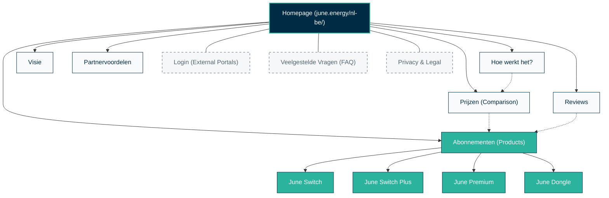

# June Energy - Visual Taxonomy & Site Map

This diagram illustrates the architectural hierarchy and connectivity of the June Energy website.

## Taxonomy Breakdown

### 1. Core Service Layer (Navigation Focus)
Essential pages that define **What** June is and **How** it delivers value.
- **Homepage:** The high-level aggregator & trust builder.
- **Hoe werkt het?:** Educational deep-dive into the "Black Box" logic of automatic switching.
- **Prijzen:** Direct comparison to enable immediate decision-making.

### 2. Product Segment Layer (Conversion Focus)
Targeted landing pages for specific user profiles.
- **The Saver (Switch):** Entry-level, focusing on simple ROI.
- **The Risk-Averse (Switch Plus):** Focusing on the "Savings Guarantee."
- **The Tech Enthusiast (Premium/Dongle):** Focusing on real-time data and solar optimization.

### 3. Trust & Loyalty Layer (Retention Focus)
Social proof and partnership ecosystems.
- **Reviews:** User-generated content and video testimonials.
- **Visie:** The "Why" behind the company, establishing ethical credibility.
- **Partnervoordelen:** B2B integration and referral benefits.

### 4. Utility Layer (Functional Focus)
Operational elements of the site.
- **Login:** Hand-off to the user dashboard.
- **FAQ:** Objection handling and support documentation.
- **Legal/Privacy:** Compliance and transparency.
